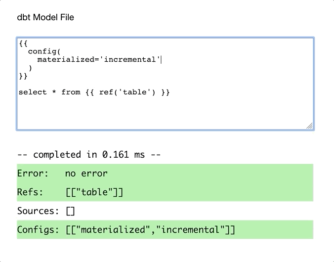

# dbt Jinja Processor



This repository contains a tool that parses the most common jinja value templates which uses tree-sitter, as well as a python app that can run the parser against example model file contents and collect the aggregated stats for how well it does.

# Architecture

This processor is composed of several stages:
1. parser
2. type checker
3. transformer
4. extractor

Additionally, the following tools utilize the above processor:
1. python runner for aggregating results against test data
2. browser-based demo of dbt extraction as you type
3. browser-based demo of tree-sitter ast generation as you type

The parser is generated into C code by tree-sitter via the grammar in `tree-sitter-dbt-jinja/grammar.js`. The python hooks are used to traverse the concrete syntax tree that tree-sitter creates in order to create a typed ast in the type checking stage (in Python, we have chosen to represent this with a nested tuple of strings). The errors in the type checking stage are not raised to the user, and are instead used by developers to debug tests. The parser is solely responsible for turning text into recognized values, while the type checker does arity checking, and enforces argument list types (e.g. nested function calls like `ref(ref('table'))` will parse but not type check since ref only accepts string arguments).

The transformation stage takes a typed ast and modifies values to change names, remove unnecessary values, and generally reshape the tree into the form we would like to use. The extractor uses this tree to easily identify all the refs, sources, and configs present and extract them to a dictionary. 

## Testing The Project
```
make test
```
Make will handle dependencies and building prior to running tests.

- Tests for the grammar are in `tree-sitter-dbt-jinja/test/corpus`
- Tests for the type checker in `tests/test_type_checker.py`
- Tests for the extractor in `tests/test_extractor.py`
- Tests for the transformer in `tests/test_transformations.py`
- Tests for the python runner are in `tests/test_parse_results.py`

## Running The Demo Apps
To see the full implementation extract dbt values run live as you type in a browser, run:
```
make demo
```
Kill the server with ctrl+c to end the demo.

To see the tree-sitter demo which displays the abstract syntax tree as you type, first make sure the docker daemon is running, then run:
```
make treedemo
```

## Running On Real Data With The Python Script
To collect aggregated results on how well this tool does on the sample data:
```
make run ARGS="results your-data-file.json"
```

If you have sample files in the form 
```
{json}
{json}
...
{json}
```
Use the `jsonify.sh` script provided in this repo to stitch them together into one large JSON array before running the above commands.

## Future Work
- Create input path for a manifest file so it can be run on any project without additional pre-processing