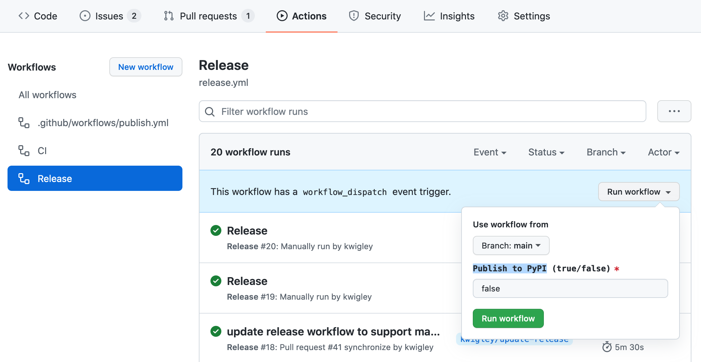

# Release Process

1. Open a PR with the version bumped in `/Cargo.toml`
e.g. `version = "0.99.0"`
2. Merge the PR after tests pass and team approval
3. Manually trigger the release via `Actions > Release > Run workflow` and set "Publish to PyPI" to `true` then hit `Run workflow` (see screenshot below)
5. Verify that the new version is on [Pypi](https://pypi.org/project/dbt-extractor/).

### Screenshot for step 3

